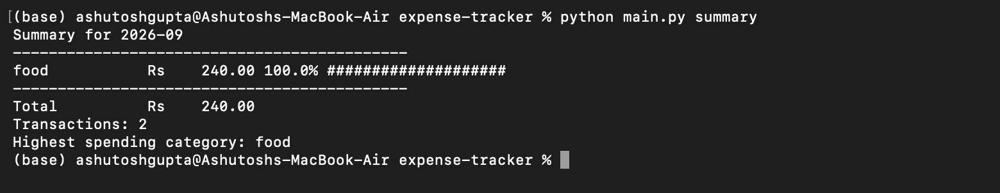
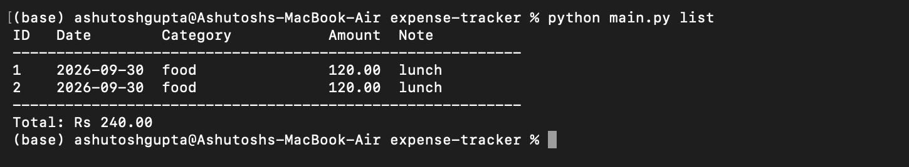
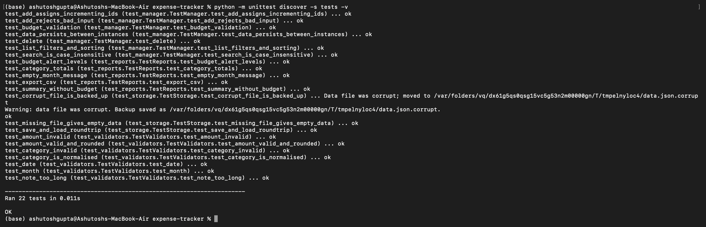

# Expense Tracker (CLI)

## Overview
A command-line tool that helps students record daily expenses, set a monthly budget,
and understand where their money goes. Built for the course *Introduction to Problem
Solving* by breaking one real-world problem into small, testable modules.

See [statement.md](statement.md) for the problem statement and scope, and
[docs/design.md](docs/design.md) for architecture and design diagrams.

## Features
- Add, list, search and delete expenses (CRUD)
- Filter by category or month; sort by date or amount
- Monthly budget with alerts (OK / 80% warning / over budget)
- Category-wise monthly summary with percentage bars
- Export expenses to CSV
- Input validation with clear error messages and exit codes
- Logging to `expense_tracker.log`; safe, atomic data saving
- Unit tests for every module

## Technologies Used
- Python 3.8+ (standard library only: `argparse`, `json`, `csv`, `logging`, `unittest`)
- Git and GitHub for version control

## Project Structure
```
expense-tracker/
├── main.py                  entry point
├── expense_tracker/
│   ├── cli.py               argument parsing and command handlers
│   ├── manager.py           add / list / search / delete / budget logic
│   ├── reports.py           summary, table formatting, CSV export
│   ├── validators.py        input validation
│   ├── storage.py           JSON persistence (atomic save, corruption recovery)
│   ├── models.py            Expense data class
│   └── logger.py            logging setup
├── tests/                   unit tests
├── docs/design.md           architecture and UML diagrams
├── statement.md             problem statement
└── requirements.txt         (no external dependencies)
```

## Installation and Running
```bash
git clone https://github.com/TheQuietArc/expense-tracker.git
cd expense-tracker
python --version          # must be 3.8 or higher
python main.py --help
```
No dependencies to install and no configuration needed. Data is saved to
`expenses.json` in the folder you run the program from.

### Commands
```bash
python main.py add 120 food --note "lunch at mess"
python main.py add 450 study --note "algorithms book" --date 2026-09-15
python main.py list
python main.py list --category food --sort amount
python main.py list --month 2026-09
python main.py search book
python main.py budget 5000
python main.py summary                 # current month
python main.py summary --month 2026-09
python main.py export --output my_expenses.csv
python main.py delete 2
```
Categories: `food`, `travel`, `study`, `rent`, `entertainment`, `other`.

Optional global flags (place before the command): `--data-file PATH`, `--log-file PATH`.

Exit codes: `0` success, `1` invalid input, `2` file error.

## Testing
From the project root:
```bash
python -m unittest discover -s tests -v
```
Tests cover validation, storage (including corrupt files), expense management,
reports, budget alerts and CSV export.

## Sample Output
```
Summary for 2026-09
--------------------------------------------
travel         Rs    900.00  61.2% ############
study          Rs    450.00  30.6% ######
food           Rs    120.00   8.2% #
--------------------------------------------
Total          Rs   1470.00
Transactions: 3
Highest spending category: travel
Budget: Rs 1500.00 | Used: 98.0% | Remaining: Rs 30.00
Warning: 80% or more of the budget is used.
```

## Screenshots

### Summary


### Expense List


### Test Run

