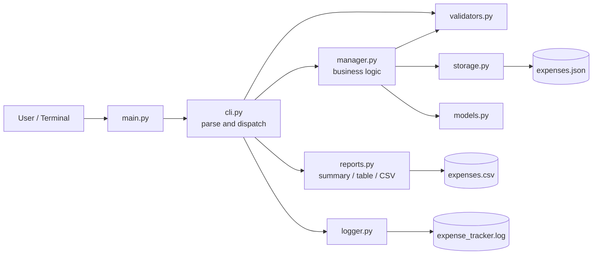
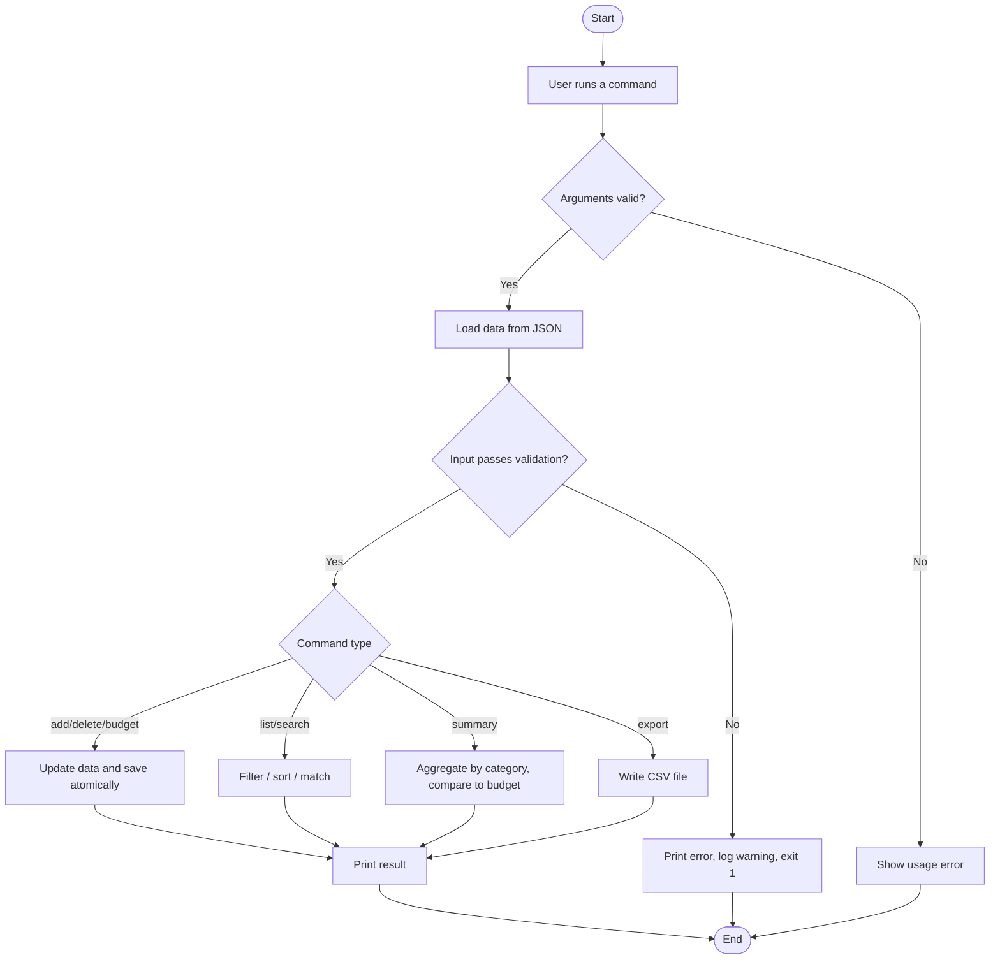
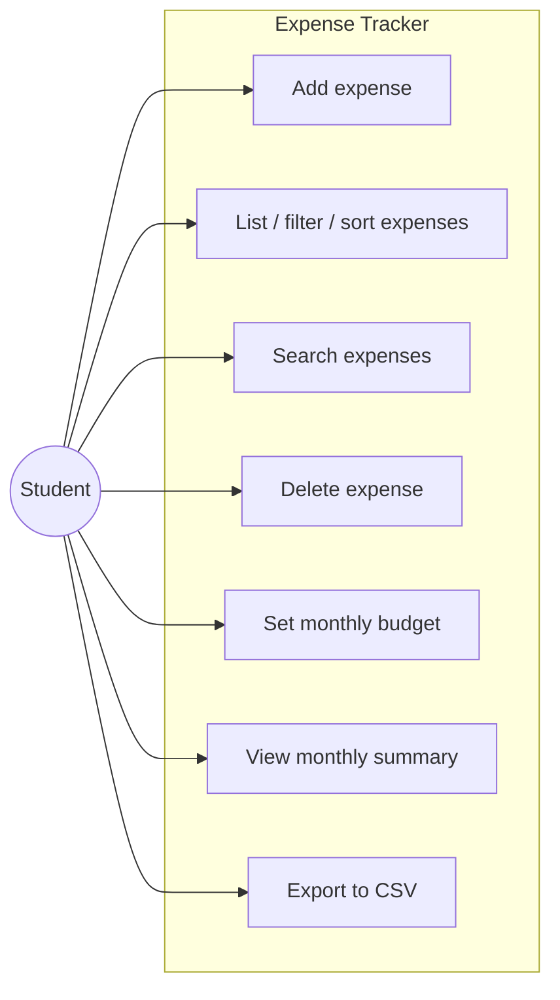
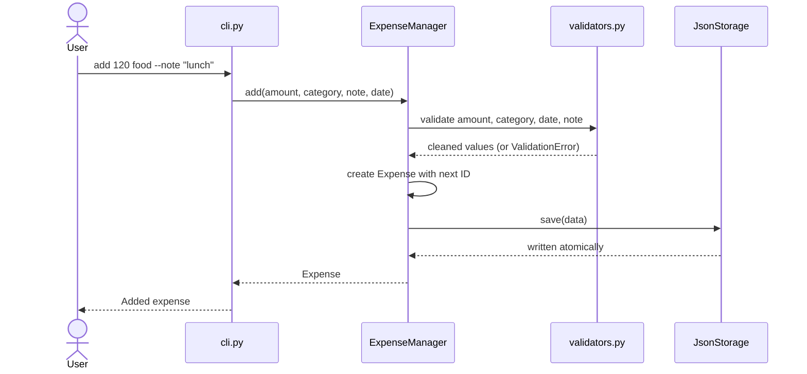
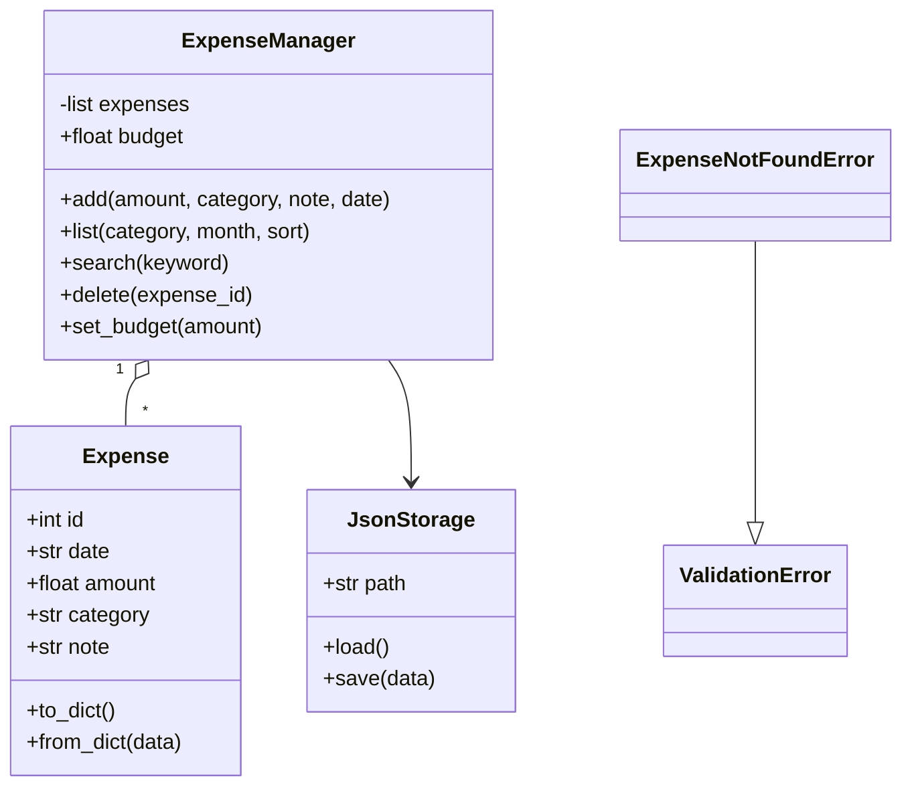
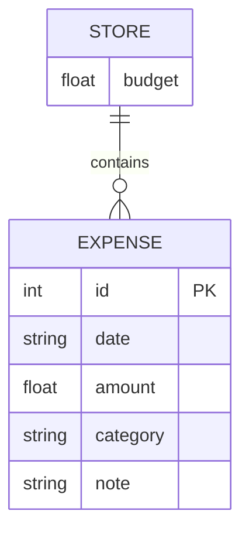

# Design Document

Diagrams are written in Mermaid, which GitHub renders automatically.
Copy each into https://mermaid.live to export it as an image for the report.

## 1. System Architecture


## 2. Workflow Diagram


## 3. Use Case Diagram


## 4. Sequence Diagram (adding an expense)


## 5. Class / Component Diagram


## 6. Storage Design / ER Diagram
Data is stored in one JSON file (`expenses.json`).

Schema:
```json
{
  "budget": 5000.0,
  "expenses": [
    {"id": 1, "date": "2026-09-10", "amount": 120.0, "category": "food", "note": "lunch"}
  ]
}
```

## 7. Non-Functional Requirements
| Requirement | How it is met |
|---|---|
| Reliability | Atomic writes (temp file + replace); corrupt file is backed up, never crashes the tool |
| Usability | Clear commands, `--help`, plain-language error messages, exit codes |
| Maintainability | Seven small modules with one responsibility each; unit tests |
| Error handling | Central validation; `ValidationError` and `OSError` handled in one place |
| Logging | Rotating log file records adds, deletes, saves, warnings and errors |
| Performance | All operations are linear scans over a small in-memory list |
| Security / safety | Input length and range limits; no network access, no code execution from input |

## 8. Design Decisions
- **JSON over a database:** data is small and single-user; JSON needs no setup and is human-readable.
- **Separate validation module:** one place for rules, reused by manager and CLI, easy to test.
- **Manager does not print:** the business logic returns data; the CLI and `reports.py` handle display, so each can change independently.
- **Standard library only:** anyone can run the project without installing anything.
